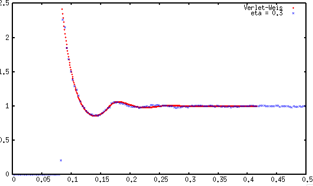

# A Simple Periodic Box Simulator for Particles and Macro-Molecules

### About
This simulator provides a simple model of particles under periodic boundaries using Metropolis-Monte Carlo Methods as outlined by Frenkel and Smit in Understanding Molecular Simulation.
The current implementation uses python 3.3 to provide a front end and most utility functions while most computation is implemented (or being ported to) C.

A radial distribution function for a simulation with a volume fraction of 0.3 roughly compared to a verlet-weis corrected distribution function.

### Install
Coming soon

### Use
The front end prompt is provided by python

	python3 interpreter.py

Available commands and simulation properties can be printed through the prompt by entering	> help

### Goals
The aim of this experiment is to model protiens with anisotropic potentials and replicate results from real world observation. The lab experiments are difficult and timely to collect. The use of a model will help in the study of rare events and overall understanding of protien mixing.

### In the Future...
- Square well and anisotropic potentials
- Threaded simulations for parallel sampling

### License
[GNU GPL](http://www.gnu.org/licenses/gpl.html)
